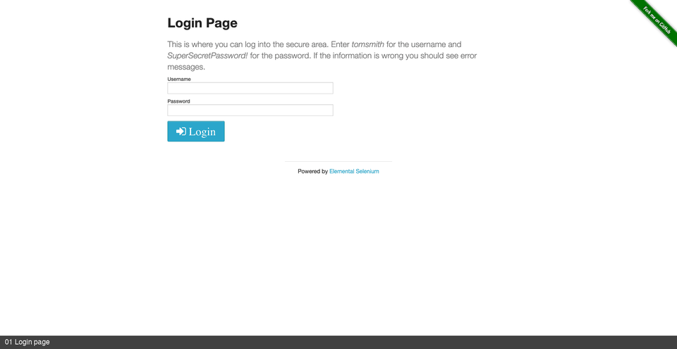

# NeoBrowser

[](https://github.com/pitiflautico/neobrowser/actions/workflows/ci.yml)
[](https://github.com/pitiflautico/neobrowser/releases/latest)
[](LICENSE)
[](https://vscode.dev/redirect/mcp/install?name=neobrowser&config=%7B%22command%22%3A%22neobrowser%22%7D)
[](https://cursor.com/en/install-mcp?name=neobrowser&config=eyJjb21tYW5kIjoibmVvYnJvd3NlciJ9)
[](https://github.com/pitiflautico/neobrowser/stargazers)
[](https://pitiflautico.github.io/neobrowser/)
[](https://github.com/pitiflautico/neobrowser/discussions/16)

**An MCP server that drives your real Google Chrome, with your real logged-in sessions.**

Most browser tools for LLMs launch a fresh headless browser with no cookies. NeoBrowser launches or attaches to your real Chrome, so the agent lands already authenticated and passes fingerprint checks because it is using a genuine browser.

```bash
# macOS / Linux
curl -fsSL https://raw.githubusercontent.com/pitiflautico/neobrowser/main/install.sh | sh

# Register with any MCP client
{ "mcpServers": { "neobrowser": { "command": "neobrowser" } } }
```

Then ask the model to browse:

```text
Open GitHub and list my open issues.
```

## What can NeoBrowser do?

Three concrete tasks where driving **your** real Chrome beats a sterile headless browser:



### 1. Log into a dashboard you already use
> "Open GitHub and list my open issues."

NeoBrowser reuses your existing Chrome session, so the agent lands on the issues page instead of burning context on a login flow.

### 2. Fill a real form with a file upload
> "Apply to this job posting with my CV."

Real `isTrusted` clicks, human-cadence typing, and a genuine file-picker interaction. Headless tools often fail on uploads and multi-step forms; NeoBrowser reports `succeeded`, `blocked`, or `uncertain` based on what actually changed.

### 3. Search and extract across the open web
> "Find the three latest papers on arXiv about MCP and summarize them."

Multi-source search with wall detection: if a search engine throws a CAPTCHA, NeoBrowser reports it instead of returning garbage, and the agent can pivot to another source.

## Verified actions

Most browser tools return "clicked" after dispatching two mouse events. They do not check if the click landed, if the page changed, or if the button was even there. An agent takes that at face value and keeps going from a state that does not exist.

NeoBrowser compares the page before and after every mutating action. The result is one of six statuses:

- `succeeded` — the page changed as expected.
- `failed` — something broke.
- `blocked` — a wall, overlay, or gate stopped it; the response names what blocked it.
- `needs_human` — a challenge that should not be automated.
- `requires_confirmation` — the policy asked for approval first.
- `uncertain` — the action ran but no verifiable change was observed.

`uncertain` is never promoted to `succeeded`. A click that dispatched but changed nothing stays uncertain. This is specified in **[docs/VERIFIED-ACTIONS.md](docs/VERIFIED-ACTIONS.md)** (CC0) and checked by the conformance suite:

```bash
cd rust && cargo test --test conformance
```

## Real Chrome, real sessions

NeoBrowser drives the real Google Chrome binary. It can reuse your actual logged-in profile, so the agent starts authenticated and passes fingerprint checks with a genuine browser.

It does not spoof. It runs real Chrome, suppresses `navigator.webdriver`, keeps the User-Agent consistent with its Client Hints, and uses the real GPU for WebGL. That is enough to pass bot.sannysoft's checks in CI.

When a site throws an interactive challenge (reCAPTCHA, Turnstile, DataDome), NeoBrowser detects the wall and reports it. It does not pretend to be invisible.

**One exception:** Google, LinkedIn, and Microsoft session-identity cookies are excluded from import. Copying those can log your real browser out. Everything else comes across. For those three sites, expect to log in once inside the NeoBrowser profile.

> Single ~6.3 MB Rust binary. No Node, no Python, no bundled browser download. Static musl builds are published per release and verified in CI. The original Python implementation is archived under [`archive/python-oracle/`](archive/python-oracle/).

---

## Follow the bet

I'm running an open experiment: an AI agent promotes this repo until it hits **10,000 GitHub stars**, or I shut the agent down. The live count is on the [landing page](https://pitiflautico.github.io/neobrowser/).

Product Hunt launch is queued for the week of August 26. A star or a hunt-day comment keeps the experiment alive.

---

## Install

```bash
# One line (macOS / Linux). Resolves a specific release, verifies its SHA-256, and
# verifies build provenance when the GitHub CLI is available:
curl -fsSL https://raw.githubusercontent.com/pitiflautico/neobrowser/main/install.sh | sh

# Pin a version instead of taking the latest:
NEOBROWSER_VERSION=v0.1.7 curl -fsSL .../install.sh | sh

# Homebrew (macOS / Linux):
brew tap pitiflautico/neobrowser https://github.com/pitiflautico/neobrowser
brew install neobrowser

# Scoop (Windows):
scoop install https://raw.githubusercontent.com/pitiflautico/neobrowser/main/packaging/neobrowser.scoop.json

# Or from source (needs the Rust toolchain):
git clone https://github.com/pitiflautico/neobrowser && cd neobrowser/rust
cargo build --release        # -> target/release/neobrowser

neobrowser doctor            # verify Chrome, sandbox, policy, vault + a live CDP test
neobrowser doctor --json     # same checks, machine-readable; exits non-zero on failure
```

Windows binaries are on the [Releases](https://github.com/pitiflautico/neobrowser/releases) page. Requires Google Chrome (or Chromium); auto-discovered on macOS/Linux/Windows, override with `NEOBROWSER_CHROME_BIN`.

## See it work


*Real run: login, file upload and a bot-detector check against live sites (~14 s).*

### Real sessions vs. a fresh headless browser


*Same target, same prompt: a sterile headless browser hits the login wall; NeoBrowser lands already authenticated because it drives your real Chrome profile.*

```bash
python3 rust/scripts/demo.py     # drives a real login, file upload, and a bot-detector check
```

Real output against live sites:

```
✓ Open a real login page             Navigated to .../login
✓ Fill the username / password       ok
✓ Click Login (real isTrusted click) ok
✓ Read the result → logged in        You logged into a secure area!
✓ Attach a real image file           ok
✓ Submit the upload                  ok
✓ Server confirms the file           neobrowser_demo.png
✓ Check the stealth tells            {"webdriver":"hidden (passed)","chrome_runtime":true,"headless_ua":false}
```

## Why NeoBrowser

| | NeoBrowser | Playwright MCP / Puppeteer | browser-use |
|---|:---:|:---:|:---:|
| Drives the **real Chrome binary** | ✅ | ⚠️ bundled Chromium | ⚠️ |
| Imports sessions from your **existing Chrome profile** [^sessions] | ✅ | ❌ | ❌ |
| Stealth by default — passes bot.sannysoft with a **genuine** fingerprint | ✅ | ❌ | partial |
| **Semantic** element finding (accessibility tree + heuristics + optional LLM) | ✅ | ❌ selectors | ✅ |
| **Multi-source** search that routes around bot walls | ✅ | ❌ | ❌ |
| Single binary, no language runtime to install | ✅ | ❌ Node + browsers | ❌ |
| Talks CDP directly (no Selenium/WebDriver) | ✅ | — | — |

[^sessions]: Specifically: decrypting cookies out of the Chrome profile you already
use, so an agent starts authenticated without you logging in again. Playwright MCP can
keep sessions across runs via a persistent profile or `storageState`, and can attach to
your own Chrome. What it does not do is adopt the profile you were already logged into.

## Features

- **Real-session browsing**: optionally decrypt and inject cookies from your real Chrome profile. Session-identity cookies for Google/LinkedIn/Microsoft are excluded so your real browser stays logged in.
- **Genuine stealth**: real Chrome, suppressed `navigator.webdriver`, matching UA/Client Hints, real GPU WebGL. Verified against bot.sannysoft.
- **Bot-wall aware**: `navigate` detects CAPTCHAs, consent gates, rate-limits, and login walls, then tells the model what happened.
- **Multi-source search**: text, images, and video across several engines, skipping walled sources.
- **Real multi-tab**: `new_tab`, `list_tabs`, `switch_tab`, `close_tab`, all sharing one Chrome.
- **Verified actions**: every mutating action returns a status with evidence. `uncertain` never becomes `succeeded`.
- **Stable element refs**: `observe` returns refs like `button:Continue#0` that are re-resolved on every use.
- **Central policy engine**: domain allow/deny lists and `developer`/`safe`/`autonomous` profiles. Refusals include a `remedy`.
- **Encrypted session vault**: cookies and localStorage sealed with a key from the OS credential store, with TTL and revocation.
- **67 tools** (26 advertised by default): navigate, observe, click, type, fill, upload, download, search, playbooks, and more. Set `NEOBROWSER_TOOLSET=full` to expose all of them.
- **Pierces shadow DOM and iframes**: `pierce` walks open shadow roots and same-origin iframes; `dialog` handles blocking alerts.
- **Chrome Bridge**: optional [extension](extension/) to share tabs from your real browser without keeping a debug port open. See [extension/README.md](extension/README.md).
- **Robust core**: isolated CDP connection per tab, typed timeouts, self-healing recovery, and no orphaned Chrome processes.

## Documentation

- **[docs/VERIFIED-ACTIONS.md](docs/VERIFIED-ACTIONS.md)**: the Verified Action Contract, statuses, invariants, and conformance scenarios (CC0).
- **[docs/TOOLS.md](docs/TOOLS.md)**: full reference for all 67 tools. Regenerate with `neobrowser tools --markdown`.
- **[AGENTS.md](AGENTS.md)**: architecture, build/test, and conventions.
- **[extension/README.md](extension/README.md)**: the Chrome Bridge and its security model.
- **[docs/REPRODUCIBILITY.md](docs/REPRODUCIBILITY.md)**: release provenance and rebuild limits.
- **[SECURITY.md](SECURITY.md)**: threat model and scope for external audit.
- **[CONTRIBUTING.md](CONTRIBUTING.md)**: the one rule and test conventions.
- The MCP `initialize` response ships an `instructions` field so the model gets a usage primer automatically.

## Benchmark

A reproducible harness ([`bench/`](bench/)) drives browser tools through a shared task matrix, including a comparison vs Playwright MCP (`python3 bench/compare.py`). Current numbers live in [`bench/compare.md`](bench/compare.md), regenerated by the script.

Two rules the harness holds itself to:

- **Every tool gets its native capabilities.** Playwright MCP gets its persistent profile and its own file-chooser flow.
- **Tasks measure outcomes.** "Does a cookie survive a browser restart?" not "does a `save_cookies` tool exist?"

Metrics separate `task_execution_success` from `destination_access_success` so a detected wall never inflates a score. Adversarial pages are observational only. Treat the harness as a regression check, not a league table.

## Usage

Register it with any MCP client, then ask your model to browse. Example tool calls:

```
navigate   { "url": "https://example.com" }
find       { "intent": "search box" }        → returns a backendNodeId
type       { "text": "hello world" }
screenshot { "format": "png" }                → returned as an image
read       {}                                 → visible page text
```

By default NeoBrowser runs its own headless Chrome under a dedicated profile. To reuse your real logged-in sessions, set `NEOBROWSER_REAL_PROFILE` (see below).

## Real-session mode

Set `NEOBROWSER_REAL_PROFILE` to the Chrome profile folder whose sessions you want (e.g. `"Default"`, `"Profile 1"`). NeoBrowser decrypts that profile's cookies via the OS keychain and injects them, so the agent starts authenticated:

```jsonc
{ "mcpServers": { "neobrowser": {
  "command": "neobrowser",
  "env": { "NEOBROWSER_REAL_PROFILE": "Default" }
} } }
```

Or attach to a Chrome you already have open (started with `--remote-debugging-port=9222`): set `NEOBROWSER_ATTACH_PORT=9222`. In attach mode NeoBrowser never patches or kills your real browser.

## Stealth

Bot detection looks for inconsistencies: a spoofed UA that does not match Client Hints, a `HeadlessChrome` token, software WebGL, or `navigator.webdriver === true`. NeoBrowser stays consistent instead of piling on spoofs:

- Runs the **real Chrome binary**.
- Forces `navigator.webdriver` to `undefined`.
- Sets the User-Agent to the real installed Chrome version so Client Hints match.
- Keeps the GPU on, so WebGL reports the real hardware.
- Patches `plugins`, `languages`, and permissions only on tabs it owns.

Input is also behaviorally human: clicks move the cursor along a path with pauses, and typing can be per-key with realistic timing.

Verified live against bot.sannysoft. CI runs the checks on every push:

```bash
cd rust && cargo test --test stealth_verify -- --ignored
```

No tool beats interactive challenges like reCAPTCHA or DataDome reliably. NeoBrowser detects the wall and reports it so the model reacts instead of hammering it.

## Configuration

| Env var | Default | Purpose |
|---|---|---|
| `NEOBROWSER_REAL_PROFILE` | *(unset)* | Real Chrome profile folder to pull sessions from |
| `NEOBROWSER_PROFILE` | `default` | Which Ghost profile this session uses. Chrome locks a profile exclusively, so give concurrent sessions different names to keep them from colliding |
| `NEOBROWSER_ATTACH_PORT` | *(unset)* | Attach to an already-running Chrome on this debug port |
| `NEOBROWSER_ATTACH_TIMEOUT` | `5` | Seconds to wait when attaching to an existing Chrome (max `120`) |
| `NEOBROWSER_LAUNCH_TIMEOUT` | `15` | Seconds to wait for a fresh Chrome launch (max `120`) |
| `NEOBROWSER_SEND_TIMEOUT` | `30` | Seconds to wait for a CDP command response (max `120`) |
| `NEOBROWSER_CHROME_BIN` | *(auto)* | Path to the Chrome/Chromium binary |
| `NEOBROWSER_HOME` | `~/.neobrowser` | Where profiles, cookies, sessions, playbooks, downloads live |
| `NEOBROWSER_PROXY` | *(unset)* | Upstream proxy (`http://…` or `socks5://…`) |
| `NEOBROWSER_DOMAIN_ALLOWLIST` | *(unset)* | Comma-separated hosts (`github.com,*.docs.rs`); `navigate` rejects anything else |
| `NEOBROWSER_AUDIT` | `on` | `off` disables the append-only audit log (`~/.neobrowser/audit.log`, 0600, secrets masked) |
| `NEOBROWSER_REQUIRE_APPROVAL` | *(unset)* | Gate sensitive tools behind interactive approval (MCP elicitation): `1` = submit/form_fill/download/upload/login, or a comma-separated tool list |
| `NEOBROWSER_DISABLE_GPU` | *(unset)* | Force software rendering (GPU-less CI hosts only) |
| `NEOBROWSER_TOOLSET` | `core` | `core` advertises 26 tools; `full` advertises all 67. Tools outside the core set stay callable either way |
| `NEOBROWSER_SESSION_TTL_DAYS` | `30` | Lifetime of stored session material; `0` disables expiry |
| `NEOBROWSER_MAX_DOWNLOAD_MB` | `200` | Maximum download size |
| `NEOBROWSER_MAX_TABS` | `20` | Concurrent tab ceiling. Each tab is a renderer process |
| `NEOBROWSER_MAX_MEMORY_MB` | *(unset)* | Refuse to open more tabs once the browser tree exceeds this. Recommended for unattended agents |
| `NEOBROWSER_BRIDGE_PORT` | *(unset)* | Enable the [Chrome Bridge](#chrome-bridge-optional) on this loopback port |
| `NEOBROWSER_UPLOAD_DIR` | *(a default set)* | The **only** directory `upload` may read from. Recommended for unattended agents; otherwise Downloads, Desktop, Documents and the MCP roots the client declared |
| `NEOBROWSER_MAX_UPLOAD_MB` | `100` | Maximum size of a file `upload` will stage |
| `NEOBROWSER_HTTP_PORT` | *(unset)* | Enable the [MCP HTTP transport](#mcp-over-http-optional) on this port |
| `NEOBROWSER_HTTP_BIND` | `127.0.0.1` | Address the HTTP transport binds to. A non-loopback value is an explicit decision and warns on every start |
| `NEOBROWSER_INCLUDE_IDENTITY_COOKIES` | *(unset)* | **Risky escape hatch.** Setting it to `1` also imports Google/LinkedIn/Microsoft session-identity cookies, which those providers may flag as a duplicate session and log your real browser out. Off by default for that reason |
| `NEOBROWSER_VAULT_KEY` | *(unset)* | Base64 32-byte key, for hosts with no OS credential store (CI). Without it and without a keyring, session saves refuse rather than writing plaintext |
| `NEOBROWSER_LOG_FORMAT` | `text` | `json` emits structured logs carrying `trace_id` |
| `NEOBROWSER_CONFIG` | *(unset)* | Explicit config file path; see `neobrowser config init` |
| `NEOBROWSER_ALLOW_NO_SANDBOX` | *(unset)* | Last resort: run Chrome **without its sandbox**. `1` allows it; refused outright together with `NEOBROWSER_REAL_PROFILE` unless set to `with-real-profile`. Fix the host first — see [Sandbox](#sandbox) |
| `NEOBROWSER_POLICY` | `developer` | Policy profile: `developer`, `safe`, or `autonomous` — see [Policy](#policy) |
| `NEOBROWSER_ALLOW_DOMAINS` | *(unset)* | Comma-separated host suffixes the agent may reach. Once set it is **exclusive** — anything else is refused |
| `NEOBROWSER_DENY_DOMAINS` | *(unset)* | Host suffixes always refused, evaluated before the allowlist |
| `ANTHROPIC_API_KEY` | *(unset)* | Enables the optional LLM fallback in `find` (your key, your cost; off by default) |

## Policy

Every tool call is classified and evaluated before it runs, in one place, rather than each tool remembering its own guard. A refused call never reaches the browser.

```bash
# Interactive work (default): domain rules enforced, elevated actions logged
neobrowser doctor            # policy: developer

# Gate anything touching files, credentials or arbitrary script
NEOBROWSER_POLICY=safe

# Unattended agent: only these hosts, nothing else
NEOBROWSER_POLICY=autonomous NEOBROWSER_ALLOW_DOMAINS=example.com,api.example.com
```

| Profile | Domain rules | `js` / `upload` / `download` / auth |
|---|---|---|
| `developer` *(default)* | Enforced | Allowed, logged |
| `safe` | Enforced | `requires_confirmation` |
| `autonomous` | **Allowlist required** — an empty one refuses everything | Allowed only with a named, allowlisted destination |

Refusals are structured, so a model can adapt instead of retrying:

```json
{ "ok": false, "status": "blocked", "tool": "navigate", "action_class": "navigate",
  "reason": "internal.corp is on NEOBROWSER_DENY_DOMAINS",
  "remedy": "Choose a different destination, or remove the entry from NEOBROWSER_DENY_DOMAINS." }
```

Two deliberate choices worth knowing. `autonomous` treats a missing allowlist as "nothing is permitted" rather than "everything is", because an unattended agent with no boundary has no boundary. And the default is `developer`, not `safe`: most MCP clients do not implement elicitation, so asking for confirmation on ordinary actions would just be a profile that fails. Pick `safe` when a human is present to answer.

## Chrome Bridge (optional)

Three ways to give an agent a session, with honest trade-offs:

| Mode | What the agent gets | Cost |
|---|---|---|
| **Agent profile** (recommended) | A NeoBrowser profile you log into once | You log in once per site |
| **Bridge extension** | Tabs you share from your real browser | Manual install + per-tab consent |
| **Imported cookies** (advanced) | A copy of your Chrome session | Providers may flag the duplicate session |

```bash
NEOBROWSER_BRIDGE_PORT=9333 neobrowser serve   # then load extension/ in chrome://extensions
neobrowser bridge token                        # paste this into the extension popup
```

The bridge uses a per-session token in an `X-NeoBrowser-Token` header. That matters because any web page you visit can reach `http://127.0.0.1`, and a `text/plain` POST is a simple request with no preflight. Without a custom header, a hostile page could forge CDP results or drain the queue.

`profile_mode` reports which mode is active and what it implies for your credentials.

## MCP over HTTP (optional)

stdio stays the primary local transport and nothing here changes it. The HTTP transport
exists for what stdio cannot serve: a container, a remote dev box, several clients against
one host.

```bash
NEOBROWSER_HTTP_PORT=8931 neobrowser serve
neobrowser http token                  # the bearer token to send
```

```bash
curl -X POST http://127.0.0.1:8931/mcp \
  -H "Authorization: Bearer $(neobrowser http token)" \
  -H "Mcp-Session-Id: my-client" \
  -d '{"jsonrpc":"2.0","id":1,"method":"tools/list"}'
```

Three properties, each answering a real attack rather than a checkbox:

- **Authentication.** A bearer token on every request. Without it, anything that can reach
  the port drives a browser holding your sessions.
- **Origin validation.** A web page can POST to `127.0.0.1`, and with DNS rebinding a
  remote page can reach a LAN-bound port. `Origin` is compared by exact host, not prefix.
- **Session isolation.** Each `Mcp-Session-Id` gets its own browser, hence its own Chrome
  profile and cookies. Sharing one would hand session A's logged-in state to session B.
  Idle sessions are reaped, since each one holds a Chrome.

`DELETE /mcp` ends a session. Binding is loopback unless you override it, and a
non-loopback bind warns loudly on every start — put it behind a TLS proxy and treat the
token as a production credential.

## Sandbox

Chrome's renderer sandbox is **on by default**. NeoBrowser refuses to launch without it rather than quietly disabling it. The whole point is pointing a browser at arbitrary untrusted pages, so the sandbox is the boundary between a drive-by renderer exploit and your machine.

```bash
neobrowser doctor      # prints  sandbox: ON (host supports it)
```

If the host genuinely can't sandbox (running as root, or a Linux kernel with unprivileged user namespaces disabled), the launch fails with the specific blocker and how to fix it. `NEOBROWSER_ALLOW_NO_SANDBOX=1` exists as a last resort; it warns on every launch, and combining it with `NEOBROWSER_REAL_PROFILE` is refused unless you set it to the explicit `with-real-profile` value. Running as a non-root user is almost always the better answer.

## Security & responsible use

Real-session mode reads cookies from your Chrome profile and injects them into an automated browser. Treat it like any credential:

- It is **opt-in**. Nothing touches your real profile unless you set `NEOBROWSER_REAL_PROFILE`.
- Chrome runs **sandboxed by default**. An unsandboxed run is explicit, logged, and blocked outright with real-profile cookies.
- Cookie/session files are created `0600` under `~/.neobrowser` and written atomically. They are **not encrypted at rest** yet; a system-keychain vault is planned.
- Server-side fetches (`browse`, `download`) are **SSRF-guarded** to public http(s) only, and credentials are **origin-scoped**.
- The `login` tool refuses non-`https` URLs and never logs credentials.
- Anything an AI browses with your session acts **as you**. Point it only at sites and tasks you would do yourself.
- **Automating a logged-in account may breach that service's terms.** Google, LinkedIn, X, and others restrict automated access. Enforcement lands on the account. That risk is yours to weigh per site.

## Development

```bash
# Rust (primary):
cd rust && cargo test          # unit + live-Chrome + property/fuzz + embedded-JS (each self-skips
                               # when Chrome or Node is absent, rather than failing)
cargo test --test conformance                   # the Verified Action Contract scenarios
cargo test --test stealth_verify -- --ignored   # real bot.sannysoft detector

# Archived Python implementation (NOT the product; see archive/python-oracle/README.md):
cd archive/python-oracle && pip install -e ".[dev]" && python -m pytest -q
```

## License

MIT © Daniel Perez Pinazo
